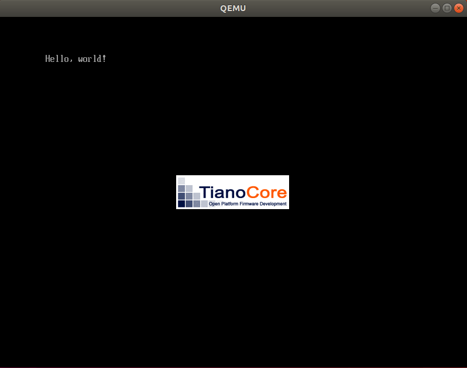

# Day1

## img作成
書籍内では様々なやり方が紹介されていたが、qemuが使いたかったので次作業としてはQEMUで試してみた。

>qemu-img create -f raw disk.img 200M

[qemu-imgは仮想ディスクイメージを作成するコマンド](https://blue-red.ddo.jp/~ao/wiki/wiki.cgi?page=KVM+%B4%D8%CF%A2%A5%B3%A5%DE%A5%F3%A5%C9#p10)  
未フォーマット(RAW形式)の仮想ディスク200MBを作成。

> mkfs.fat -n 'MIKAN OS' -s 2 -f 2 -R 32 -F 32 disk.img

[FATファイルシステムを作成するコマンド](https://manpages.debian.org/testing/dosfstools/mkfs.fat.8.en.html)  
[FATファイルシステムに関する分かりやすい説明](http://memes.sakura.ne.jp/memes/?page_id=2303)  
|オプション|内容|
|---|---|
|-n|ボリューム名|
|-s|クラスター内のセクター数|
|-f|FATファイルシステムの数(デフォルト値と同じ)|
|-R|リザーブドセクターの数(デフォルト値と同じ)|
|-F|FATサイズ(FAT32形式を作成)|

> sudo mount -o loop disk.img mnt

mount時にloopをつけることでファイルをブロック型デバイス([ループバック・デバイス](https://tototoshi.hatenablog.com/entry/20100528/1275061922))として扱う機能。  
これによってイメージファイルの直接操作が可能。  

## QEMU起動
>qemu-system-x86_64 \
    -drive if=pflash,file=OVMF_CODE.fd \
    -drive if=pflash,file=OVMF_VARS.fd \
    -hda disk.img

driveオプションで指定しているのは, PC System Flashのこと。  
OVMFはOpen Virtual Machine Firmwareの略称であり、仮想環境用のUEFIに使われるようだ。  
OVMFはおそらく今後自分でも作成するのだろう。  
hdaは使用する仮想ディスクのことだろう。  

OVMFの出処はここかな、と推測。  
https://www.tianocore.org/  

## Ansible
IaC(Infrastructure as Code)を実現するための構成管理ツール。  
[Qiitaに分かりやすい解説記事](https://qiita.com/comefigo/items/d749001da5637e09cb1b)があった。  
ansible_inventryにホストの情報を残しておき、  
ansible_provisionにて各タスクを実行してaptなどを実行していく。    
細かくは追わないことにするが、自前のLinux環境を整備したい時はこういうの使ったほうがいいのかなー。  
