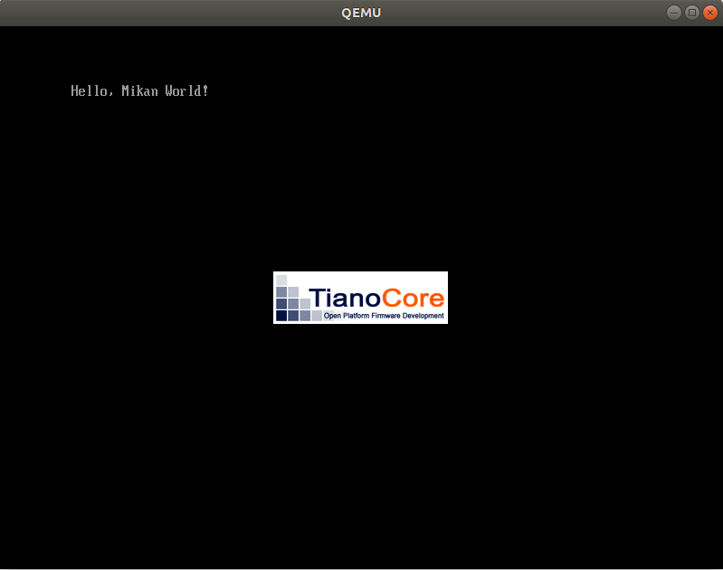
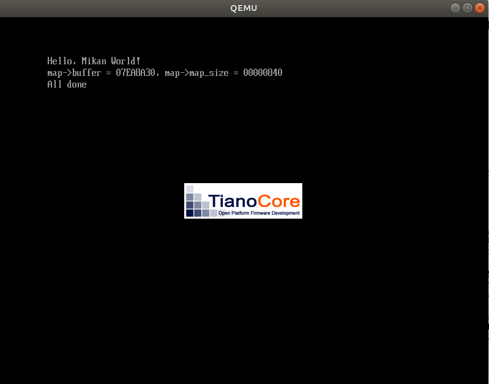

# Day2

## EDKII

UEFI上で動くアプリケーション及びUEFI自体の開発キット。
EDKIIに最低限必要なファイルが3種類あり、

- パッケージ宣言ファイル(.dec): パッケージ名などを設定
- パッケージ記述ファイル(.dsc):  
[define]ホストの情報やアーキテクチャの設定  
[LibrarycClass]必要なライブラリ名と実際に要するライブラリ(.inf)のパスを指定  
[Conponents]ビルド時のコンポーネント(.inf)を指定
- モジュール情報ファイル(.inf): 詳しくは[EDKII Module Information File Specification](https://edk2-docs.gitbook.io/edk-ii-inf-specification/)参照

EDKIIのライブラリを使ったMainコードは下記。  
エントリポイントなどはLoader.infでUefiMainを指すようになっているだけなので、名前が一致すれば名称は何でも良さそうだ。
```
#include  <Uefi.h>
#include  <Library/UefiLib.h>

EFI_STATUS EFIAPI UefiMain(
    EFI_HANDLE image_handle,
    EFI_SYSTEM_TABLE *system_table) {
  Print(L"Hello, Mikan World!\n");
  while (1);
  return EFI_SUCCESS;
}
```

Buildの流れとしては

1. Build対象のソースコード、dec, dsc, infをまとめたディレクトリへのシンボリックリンクをedk2内にはる。
2. edksetup.shをsource実行(多分PATHを通すだけかと)
3. Conf/target.infにACTIVE_PLATGORM/TARGET/TARGET_ARCH/TOOL_CHAIN_TAGを最低限指定
4. buildを実行し、EFIを生成。

Day01でのスクリプトでBOOT Imageを作成してQEMUで起動。  


## メモリマップ取得

メモリマップ取得のコード
```
struct MemoryMap {
  UINTN buffer_size;
  VOID* buffer;
  UINTN map_size;
  UINTN map_key;
  UINTN descriptor_size;
  UINT32 descriptor_version;
};

EFI_STATUS GetMemoryMap(struct MemoryMap* map) {
  if (map->buffer == NULL) {
    return EFI_BUFFER_TOO_SMALL;
  }

  map->map_size = map->buffer_size;
  return gBS->GetMemoryMap(
      &map->map_size,
      (EFI_MEMORY_DESCRIPTOR*)map->buffer,
      &map->map_key,
      &map->descriptor_size,
      &map->descriptor_version);
}
```

GetMemoryMapに関して[規格書](https://uefi.org/specifications)にある程度[詳細](https://uefi.org/specs/ACPI/6.4/15_System_Address_Map_Interfaces/uefi-getmemorymap-boot-services-function.html?highlight=getmemorymap)が載っている。  
※リンクはv6.4を参照

gBS->GetMemorySizeの実際のFunction仕様は[こちら](https://uefi.org/sites/default/files/resources/UEFI_Spec_2_9_2021_03_18.pdf)のPDFに記載。  
|Args|Type|Detail|
|---|---|---|
|MemoryMapSize|IN OUT UININ|メモリマップ書き込み用メモリ領域の大きさを設定|  
|MemoryMap|OUT EFI_MEMORY_DESCRIPTOR|メモリマップ書き込み用メモリ領域の先頭アドレスを設定|
|MapKey|OUT UINTN|メモリマップ識別値を書き込む変数を設定|
|DescriptorSize|OUT UINTN|メモリマップの個々の行を表すメモリディスクリプタのバイト数|
|DescriptorVersion|OUT UINT32|メモリディスクリプタの構造体のバージョン番号|

メモリディスクリプタについては下記。
|Member|Type|Detail|
|---|---|---|
|Type|UINT32|メモリ領域の種別|  
|PhysicalStart|EFI_PHYSICAL_ADDRESS|メモリ領域先頭の物理メモリアドレス|
|VirtualStart|EFI_VIRTUAL_ADDRESS|メモリ領域先頭の仮想メモリアドレス|
|NumberOfPages|UINT64|メモリ領域の大きさ(4KiBページ単位)|
|Attribute|UINT64|メモリ領域が使える用途を示すビット集合|

メモリマップをファイルに保存する処理をメイン関数に新たに加えている
```
  // メモリマップバッファを作成してメモリマップを取得
  CHAR8 memmap_buf[4096 * 4];
  struct MemoryMap memmap = {sizeof(memmap_buf), memmap_buf, 0, 0, 0, 0};
  GetMemoryMap(&memmap);

  // Root Directoryを開く
  EFI_FILE_PROTOCOL* root_dir;
  OpenRootDir(image_handle, &root_dir);

  // ファイルオープン
  EFI_FILE_PROTOCOL* memmap_file;
  root_dir->Open(
      root_dir, &memmap_file, L"\\memmap",
      EFI_FILE_MODE_READ | EFI_FILE_MODE_WRITE | EFI_FILE_MODE_CREATE, 0);

  // メモリマップ情報を書き込み
  SaveMemoryMap(&memmap, memmap_file);
  memmap_file->Close(memmap_file);
```

SaveMemoryMap関数は下記内容になっています。
```
EFI_STATUS SaveMemoryMap(struct MemoryMap* map, EFI_FILE_PROTOCOL* file) {
  CHAR8 buf[256];
  UINTN len;

  // ヘッダを作成し、ASCIIコードにして書き込み
  CHAR8* header =
    "Index, Type, Type(name), PhysicalStart, NumberOfPages, Attribute\n";
  len = AsciiStrLen(header);
  file->Write(file, &len, header);

  // メモリマップのサイズ系の情報を出力
  Print(L"map->buffer = %08lx, map->map_size = %08lx\n",
      map->buffer, map->map_size);

  // メモリマップ情報をASCIIコードにして書き込み
  EFI_PHYSICAL_ADDRESS iter;
  int i;
  for (iter = (EFI_PHYSICAL_ADDRESS)map->buffer, i = 0;
       iter < (EFI_PHYSICAL_ADDRESS)map->buffer + map->map_size;
       iter += map->descriptor_size, i++) {
    // メモリマップのバッファを移動するイテレータでloop処理
    EFI_MEMORY_DESCRIPTOR* desc = (EFI_MEMORY_DESCRIPTOR*)iter;
    len = AsciiSPrint(
        buf, sizeof(buf),
        "%u, %x, %-ls, %08lx, %lx, %lx\n",
        i, desc->Type, GetMemoryTypeUnicode(desc->Type),
        desc->PhysicalStart, desc->NumberOfPages,
        desc->Attribute & 0xffffflu);
    file->Write(file, &len, buf);
  }

  return EFI_SUCCESS;
}
```

この状態でEDKIIでEFIを作ってdisk.imgを作成し、QEMUで起動。  
少しだけログ出力が追加されている。  


またmemmapというファイルが作成されており、下記出力が出ているのを確認できた。  
```
Index, Type, Type(name), PhysicalStart, NumberOfPages, Attribute
0, 3, EfiBootServicesCode, 00000000, 1, F
1, 7, EfiConventionalMemory, 00001000, 9F, F
2, 7, EfiConventionalMemory, 00100000, 700, F
3, A, EfiACPIMemoryNVS, 00800000, 8, F
4, 7, EfiConventionalMemory, 00808000, 8, F
5, A, EfiACPIMemoryNVS, 00810000, F0, F
6, 4, EfiBootServicesData, 00900000, B00, F
7, 7, EfiConventionalMemory, 01400000, 2B36, F
8, 4, EfiBootServicesData, 03F36000, 20, F
9, 7, EfiConventionalMemory, 03F56000, 273E, F
10, 1, EfiLoaderCode, 06694000, 2, F
11, 4, EfiBootServicesData, 06696000, 1E8, F
12, 3, EfiBootServicesCode, 0687E000, B6, F
13, A, EfiACPIMemoryNVS, 06934000, 12, F
14, 0, EfiReservedMemoryType, 06946000, 1C, F
15, 3, EfiBootServicesCode, 06962000, 10A, F
16, 6, EfiRuntimeServicesData, 06A6C000, 5, F
17, 5, EfiRuntimeServicesCode, 06A71000, 5, F
18, 6, EfiRuntimeServicesData, 06A76000, 5, F
19, 5, EfiRuntimeServicesCode, 06A7B000, 5, F
20, 6, EfiRuntimeServicesData, 06A80000, 5, F
21, 5, EfiRuntimeServicesCode, 06A85000, 7, F
22, 6, EfiRuntimeServicesData, 06A8C000, 8F, F
23, 4, EfiBootServicesData, 06B1B000, 70D, F
24, 7, EfiConventionalMemory, 07228000, 2, F
25, 4, EfiBootServicesData, 0722A000, 7, F
26, 7, EfiConventionalMemory, 07231000, 2, F
27, 4, EfiBootServicesData, 07233000, 7E8, F
28, 7, EfiConventionalMemory, 07A1B000, 1, F
29, 3, EfiBootServicesCode, 07A1C000, 17F, F
30, 5, EfiRuntimeServicesCode, 07B9B000, 30, F
31, 6, EfiRuntimeServicesData, 07BCB000, 24, F
32, 0, EfiReservedMemoryType, 07BEF000, 4, F
33, 9, EfiACPIReclaimMemory, 07BF3000, 8, F
34, A, EfiACPIMemoryNVS, 07BFB000, 4, F
35, 4, EfiBootServicesData, 07BFF000, 201, F
36, 7, EfiConventionalMemory, 07E00000, 8D, F
37, 4, EfiBootServicesData, 07E8D000, 20, F
38, 3, EfiBootServicesCode, 07EAD000, 20, F
39, 4, EfiBootServicesData, 07ECD000, 9, F
40, 3, EfiBootServicesCode, 07ED6000, 1E, F
41, 6, EfiRuntimeServicesData, 07EF4000, 84, F
42, A, EfiACPIMemoryNVS, 07F78000, 88, F
43, 6, EfiRuntimeServicesData, FFC00000, 400, 1
```
