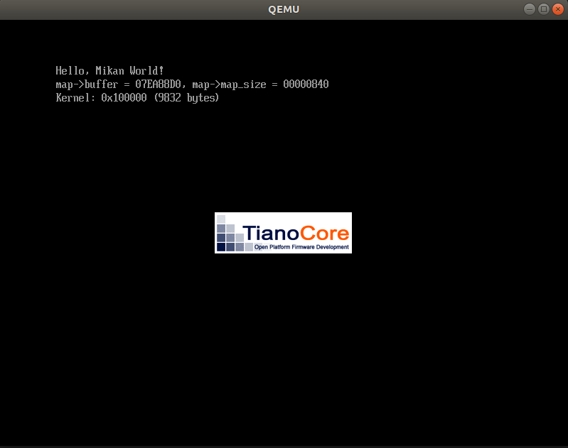
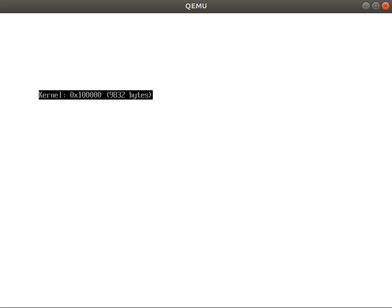
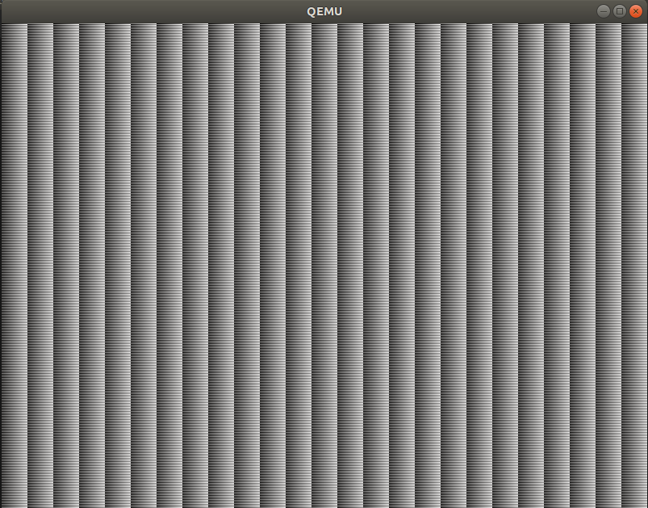

# Day3

## QEMUモニタ
-monitor stdioをつけることでQEMU起動時にターミナルでQEMUモニタが利用可能。
```
qemu-system-x86_64 \
    -drive if=pflash,file=OVMF_CODE.fd \
    -drive if=pflash,file=OVMF_VARS.fd \
    -hda disk.img \
    -monitor stdio
```

info registersを実行するとCPUのレジスタ情報が確認できる。
```
(qemu) info registers
RAX=0000000000000000 RBX=0000000000000001 RCX=0000000007b7b1c0 RDX=0000000000000002
RSI=0000000000000400 RDI=0000000007ea9270 RBP=000000000000002c RSP=0000000007ea88a0
R8 =00000000000000af R9 =0000000000000288 R10=0000000000000050 R11=0000000000000000
R12=0000000006695568 R13=0000000007ea8930 R14=000000000722a920 R15=0000000007ea88e8
RIP=0000000006694416 RFL=00000202 [-------] CPL=0 II=0 A20=1 SMM=0 HLT=0
ES =0030 0000000000000000 ffffffff 00cf9300 DPL=0 DS   [-WA]
CS =0038 0000000000000000 ffffffff 00af9a00 DPL=0 CS64 [-R-]
SS =0030 0000000000000000 ffffffff 00cf9300 DPL=0 DS   [-WA]
DS =0030 0000000000000000 ffffffff 00cf9300 DPL=0 DS   [-WA]
FS =0030 0000000000000000 ffffffff 00cf9300 DPL=0 DS   [-WA]
GS =0030 0000000000000000 ffffffff 00cf9300 DPL=0 DS   [-WA]
LDT=0000 0000000000000000 0000ffff 00008200 DPL=0 LDT
TR =0000 0000000000000000 0000ffff 00008b00 DPL=0 TSS64-busy
GDT=     0000000007bee698 00000047
IDT=     0000000007306018 00000fff
CR0=80010033 CR2=0000000000000000 CR3=0000000007c01000 CR4=00000668
DR0=0000000000000000 DR1=0000000000000000 DR2=0000000000000000 DR3=0000000000000000 
DR6=00000000ffff0ff0 DR7=0000000000000400
EFER=0000000000000500
FCW=037f FSW=0000 [ST=0] FTW=00 MXCSR=00001f80
FPR0=0000000000000000 0000 FPR1=0000000000000000 0000
FPR2=0000000000000000 0000 FPR3=0000000000000000 0000
FPR4=0000000000000000 0000 FPR5=0000000000000000 0000
FPR6=0000000000000000 0000 FPR7=0000000000000000 0000
XMM00=00000000000000000000000000000000 XMM01=00000000000000000000000000000000
XMM02=00000000000000000000000000000000 XMM03=00000000000000000000000000000000
XMM04=00000000000000000000000000000000 XMM05=00000000000000000000000000000000
XMM06=00000000000000000000000000000000 XMM07=00000000000000000000000000000000
XMM08=00000000000000000000000000000000 XMM09=00000000000000000000000000000000
XMM10=00000000000000000000000000000000 XMM11=00000000000000000000000000000000
XMM12=00000000000000000000000000000000 XMM13=00000000000000000000000000000000
XMM14=00000000000000000000000000000000 XMM15=00000000000000000000000000000000
```
また、下記コマンドでメモリ領域の値表示も可能。  
```
x /fmt addr  
(/fmtには/[個数][フォーマット][サイズ]が指定できる。)
```
```
(qemu) x /4xb 0x06694416
0000000006694416: 0xeb 0xfe 0x55 0x41
```
```
(qemu) x /2i 0x06694416
0x0000000006694416:  jmp    0x6694416
0x0000000006694418:  push   %rbp
```

なお、0x06694416を選んだのは、これがRIP=プログラムカウンタなので、  
何かしらの機械語命令が入っていることを推測できます。  
(筆者みたいに0xeb=jmpだ!となるほどアセンブリには慣れてないが...)  

なお、下記は同じアドレスにjmpし続けるので無限ループしていることになる。  
while(1)と同義ですね。  
```
0x0000000006694416:  jmp    0x6694416
```

## kernel作成
hlt命令で省電力状態にするKernelMain関数を作成。
```
extern "C" void KernelMain() {
  while (1) __asm__("hlt");
}
```
なお、マングリングすることでC言語形式のシンボルになる。  

コンパイルは下記によって実施。  
```
clang++ -O2 -Wall -g --target=x86_64-elf -ffreestanding -mno-red-zone \
-fno-exceptions -fno-rtti -std=c++17 -c main.cpp
```
|コンパイルオプション|意味|
|---|---|
|-O2|レベル2最適化|
|-Wall|全てのWarningを有効化|
|-g|デバッグ情報付きでコンパイル|
|--target=x86_64-elf|x86_64向け出力の機械語を生成し、ELF形式で出力|
|-ffreestanding|フリースタンディング環境(OSレス環境)向けコンパイル|
|-mno-red-zone|RedZone機能の無効化|
|-fno-exceptions|C++例外を無効化|
|-fno-rtti|C++の実行時型情報を使わない|
|-std=c++17|c++17でコンパイル|
|-c|コンパイルのみ実行|

- RedZoneはx86_64のABIで定義されているスタックポインタを超えた位置にある128byte領域のことであり、  
ユーザプログラムではスタックポインタの加減算を調整不要になるのでちょっとした高速化が望める。  
ただ、RedZone使用中に割り込みが発生するとデータ破壊が起こるので、割り込みハンドラに工夫が必要になる。  
OS開発プログラムでは基本的に無効化が推奨。  
- RTTI(RunTimeTypeIdentification)はdynamic castに必要。C++にて実行時に派生クラスにしたい場合などに利用。  
当然コストが発生するので、使用しないプログラムならば使わないほうが良い。  

|リンカオプション|意味|
|---|---|
|--entry KernelMain|エントリポイントをKernelMain()に設定|
|-z norelro|リロケーション情報を読み込み専用にする機能を無効化|
|--image-base 0x100000|出力バイナリのベースアドレスを0x100000に設定|
|-o kernel.elf|kernel.elfファイルを出力|
|--static|静的リンクを実行|

このKernelMainをもつkernel.elfをBootLoaderから呼び出す必要がある。  
この書籍ではKernel.elfをドライブ上に格納し、UEFIからKernelを呼び出すように実施。    
```
  // ルートディレクトリを開く
  EFI_FILE_PROTOCOL* kernel_file;
  root_dir->Open(
      root_dir, &kernel_file, L"\\kernel.elf",
      EFI_FILE_MODE_READ, 0);

  // kernel用のバッファを確保
  UINTN file_info_size = sizeof(EFI_FILE_INFO) + sizeof(CHAR16) * 12;
  UINT8 file_info_buffer[file_info_size];
  kernel_file->GetInfo(
      kernel_file, &gEfiFileInfoGuid,
      &file_info_size, file_info_buffer);

  // kernelファイルサイズを取得
  EFI_FILE_INFO* file_info = (EFI_FILE_INFO*)file_info_buffer;
  UINTN kernel_file_size = file_info->FileSize;

  // ベースアドレスを設定し、アロケータで取得。Readによってkernel.elfを読み込む。
  // AllocateAddressを使うことで確実に0x100000番地に置かれるようにしている。
  // ページ数は4KiB Alignmentさせないとダメなので(kernel_file_size + 0xfff) / 0x1000で確保。
  EFI_PHYSICAL_ADDRESS kernel_base_addr = 0x100000;
  gBS->AllocatePages(
      AllocateAddress, EfiLoaderData,
      (kernel_file_size + 0xfff) / 0x1000, &kernel_base_addr);
  kernel_file->Read(kernel_file, &kernel_file_size, (VOID*)kernel_base_addr);
  Print(L"Kernel: 0x%0lx (%lu bytes)\n", kernel_base_addr, kernel_file_size);
```

EFI_FILE_INFO構造体については下記表にまとめる。  
|Member|Type|Detail|
|---|---|---|
|Size|UINT64|EFI_FILE_INFO構造体のサイズ|  
|FileSize|UINT64|ファイルサイズ|
|PhysicalSize|UINT64|物理メモリサイズ|
|CreateTime|EFI_TIME|ファイルを生成した時間|
|LastAccessTime|EFI_TIME|ファイルに最後にアクセスした時間|
|ModificationTime|EFI_TIME|ファイルを最後に変更した時間|
|Attribute|UINT64|ファイル用の属性を記録する場所|
|FileName|CHAR16[]|ファイル名|  

なお、FIleNameは要素数が省略されており、sizeofで取得する範囲に入らない。  
sizeof(CHAR16) * 12を足しているのはこのため。  

また、Kernel起動前にUEFIのBoot Serviceを止める必要があるので、下記コードで停止させる。  
```
  // 最新のメモリマップから取得できるマップキーを使ってBootServiceを終了させる。
  // キーが合わない場合は再取得した後に再度ExitBootServiceを呼び出す。
  EFI_STATUS status;
  status = gBS->ExitBootServices(image_handle, memmap.map_key);
  if (EFI_ERROR(status)) {
    status = GetMemoryMap(&memmap);
    if (EFI_ERROR(status)) {
      Print(L"failed to get memory map: %r\n", status);
      while (1);
    }
    status = gBS->ExitBootServices(image_handle, memmap.map_key);
    if (EFI_ERROR(status)) {
      Print(L"Could not exit boot service: %r\n", status);
      while (1);
    }
  }
```

その後、Kernelを呼び出す。
```
  UINT64 entry_addr = *(UINT64*)(kernel_base_addr + 24);

  // EntryPointTypeという引数と戻り値がどちらもvoid型の関数を定義し、entry_addrを呼び出す。
  typedef void EntryPointType(void);
  EntryPointType* entry_point = (EntryPointType*)entry_addr;
  entry_point();
```
Entry_Addressに関してはReadelfするとわかるエントリポイントアドレス情報が  
offset 24に存在するため。
```
readelf -h kernel.elf 
ELF ヘッダ:
  マジック:   7f 45 4c 46 02 01 01 00 00 00 00 00 00 00 00 00 
...
 エントリポイントアドレス:               0x101000
...
```

このUEFIを使ってKernelを呼び出す処理をQEMUで実行すると下記で止まる。  


QEMUモニタでプログラムカウンタの値を確認し、実行している命令が何なのか見てみると、  
hlt命令で止まっているのが見てわかる。kernel呼び出し成功。
```
(qemu) info registers
...
RIP=0000000000101011
...
(qemu) x /2i 0x101011
0x0000000000101011:  jmp    0x101010
0x0000000000101013:  int3
(qemu) x /2i 0x101010
0x0000000000101010:  hlt    
0x0000000000101011:  jmp    0x101010
```

## BootLoaderでピクセルを描く
UEFIにはGOP(Graphics Output Protocol)という機能でピクセル単位での描画をするための情報取得が可能。  
書き込むための情報としては、  
- FrameBufferの先頭アドレス(FrameBufferとはディスプレイ描画用に確保されているバッファのこと)
- FrameBufferの解像度
- FrameBufferの非表示領域幅。
- 1 Pixelのデータ量。8bitなら256階調, RGBにして1677万色の表現が可能。

GOPの処理は下記で実施。
```
  // GOPで情報取得
  EFI_GRAPHICS_OUTPUT_PROTOCOL* gop;
  OpenGOP(image_handle, &gop);
  Print(L"Resolution: %ux%u, Pixel Format: %s, %u pixels/line\n",
      gop->Mode->Info->HorizontalResolution,
      gop->Mode->Info->VerticalResolution,
      GetPixelFormatUnicode(gop->Mode->Info->PixelFormat),
      gop->Mode->Info->PixelsPerScanLine);
  Print(L"Frame Buffer: 0x%0lx - 0x%0lx, Size: %lu bytes\n",
      gop->Mode->FrameBufferBase,
      gop->Mode->FrameBufferBase + gop->Mode->FrameBufferSize,
      gop->Mode->FrameBufferSize);

  // framebufferの先頭アドレスを取得し、FrameBufferSize文だけ255で埋める。
  // (白一色になる。)
  UINT8* frame_buffer = (UINT8*)gop->Mode->FrameBufferBase;
  for (UINTN i = 0; i < gop->Mode->FrameBufferSize; ++i) {
    frame_buffer[i] = 255;
  }
```

QEMUの実際の画面がこちら。見事に真っ白である。  
(白一色にしてからkernel呼び出し系を動かしているので、その部分はFrameBufferを上書きする。)


## Kernelでピクセルを描く

kernel側にframe_bufferの情報を渡して、kernel側でframe_bufferの情報を更新する。  
0-255をずっと繰り返すような描画がされるようにしている。   
```
#include <cstdint>

extern "C" void KernelMain(uint64_t frame_buffer_base,
                           uint64_t frame_buffer_size) {
  uint8_t* frame_buffer = reinterpret_cast<uint8_t*>(frame_buffer_base);
  for (uint64_t i = 0; i < frame_buffer_size; ++i) {
    frame_buffer[i] = i % 256;
  }
  while (1) __asm__("hlt");
}
```
frame_buffer_baseはuint64_tだが、このアドレス値をuint8_t型のポインタとして扱いたいため、  
C++におけるreinterpret_castを使ってキャストしている。  
[reinterpret_cast](http://www7b.biglobe.ne.jp/~robe/cpphtml/html02/cpp02041.html)は通常のキャストでは危険なキャストになるポインタが絡むキャストをしたい場合に用いるキャスト。  
普段から使うようなキャストではないので乱用注意。  

なおcstdintは標準のINCLUDE_PATH上にはないのでビルド時に場所を教える必要がある。  
書籍ではmikanos-buildの環境を指定しているが、自環境に合わせたかったのでfindコマンドで探して指定。  
結果的には下記をつける必要があった。  
```
-I/usr/include/c++/7 -I/usr/include/x86_64-linux-gnu/ -I/usr/include/x86_64-linux-gnu/c++/7/ 
```

また、kernel側のInterfaceを変えていることになるので、bootloader側も引数を渡すように変更。  
```
  typedef void EntryPointType(UINT64, UINT64);
  EntryPointType* entry_point = (EntryPointType*)entry_addr;
  entry_point(gop->Mode->FrameBufferBase, gop->Mode->FrameBufferSize);
```

こうして出力されるピクセル更新結果がこれ。  
ピクセルデータ形式が不明なのでどうなるかは不明だが、この感じだと8bit GrayScaleで出力されているようだ。


## エラー処理
今から作っているのはOSなので、  
正常に動作しない場合には動き続けないようにプログラムを作っておかなければなりません。  
(別にOSに限った話ではないけども…)  
ここではEFI_STATUS型のstatus変数を生成しておき、例えば下記のようにしておく。  
```
void Halt(void) {
  while (1) __asm__("hlt");
}

EFI_STATUS EFIAPI UefiMain(
    EFI_HANDLE image_handle,
    EFI_SYSTEM_TABLE* system_table) {
  EFI_STATUS status;
...
  status = gBS->AllocatePages(
      AllocateAddress, EfiLoaderData,
      (kernel_file_size + 0xfff) / 0x1000, &kernel_base_addr);
  if (EFI_ERROR(status)) {
    Print(L"failed to allocate pages: %r", status);
    Halt();
  }
...
```
AllocatePagesでメモリ確保しにいこうとするが、  
失敗した際にはエラーメッセージを出して、Haltで無限ループさせる処理。  
無限ループはエラーメッセージを残しておきたいため。  
returnを使うと起動処理を続けようとする場合があるのでエラーが消えてしまう。  
