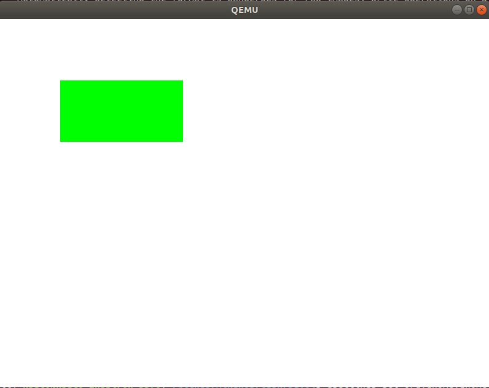

# Day4

## makeについて
基本知識が殆どだがおさらいがてらまとめる。  
```make
TARGET = kernel.elf
OBJS = main.o

CXXFLAGS += -O2 -Wall -g --target=x86_64-elf -ffreestanding -mno-red-zone \
            -fno-exceptions -fno-rtti -fshort-wchar -std=c++17
LDFLAGS  += --entry KernelMain -z norelro --image-base 0x100000 --static
```
上記はビルドに必要な変数をまとめたもの。  
コンパイル、リンカオプションの意味は[Day03](../Day03/README.md)を参照  
なお、本環境は特にIncludePathをclang向けに設定できてないので、下記の設定が必要。
```make
CXXFLAGS += -I/usr/include/c++/11 -I/usr/include/x86_64-linux-gnu/ -I/usr/include/x86_64-linux-gnu/c++/11/
```

```make
.PHONY: all
all: $(TARGET)

.PHONY: clean
clean:
	rm -rf *.o

kernel.elf: $(OBJS) Makefile
	ld.lld $(LDFLAGS) -o kernel.elf $(OBJS)

%.o: %.cpp Makefile
	clang++ $(CPPFLAGS) $(CXXFLAGS) -c $<
```

これはルールと呼ばれるもので、下記のような構成になっている。  
```txt
ターゲット: 必須項目
    レシピ
```
.PHONYはphony target(偽ターゲット)という意味で、  
上記のようなall, cleanなど具体的なファイルがない場合でもルールを作る場合に宣言するもの。  
※なお、実際にall, cleanというファイル名があるときには必須設定になる。

今回の場合、make allを実行すると下記のフローで実行される。  
```make
all: $(TARGET)=kernel.elf
    kernel.elf: $(OBJS)=main.o Makefile
        %.o=main.o: %.cpp=main.cpp Makefile
            main.cppのルールはないのでストップ
            Makefileのルールはないのでストップ
            clang++ $(CPPFLAGS) $(CXXFLAGS) -c $<=main.cpp
        Makefileのルールはないのでストップ
    ld.lld $(LDFLAGS) -o kernel.elf $(OBJS)=main.o
```

# ピクセル描画
UEFIにてピクセルのデータ形式は下記のように定められている。  
[UEFIの仕様書](https://uefi.org/sites/default/files/resources/UEFI_Spec_2_8_final.pdf)の  
PDFで見づらいので、RustのRedoxOSで使われている[UEFIの仕様](https://docs.rs/redox_uefi/0.1.0/uefi/graphics/enum.GraphicsPixelFormat.html)も参考として挙げておく。  
|データ形式|説明|
|---|---|
|PixelRedGreenBlueReserved8BitPerColor|1ピクセルは32ビットで、バイト0が赤、バイト1が緑、バイト2が青、バイト3が予約。赤、緑、青の各成分のバイト値は、色の強度を表していて、最小の強さ0から最大の強さ255までの範囲になる。|
|PixelBlueGreenRedReserved8BitPerColor|1ピクセルは32ビットで、バイト0が青、バイト1が緑、バイト2が赤、バイト3が予約。青、緑、赤の各成分のバイト値は、色の強度を表していて、最小の強さ0から最大の強さ255までの範囲になる。|
|PixelBitMask|固有のBitMask設定によって色表現を行う。基本使わない。|
|PixelBltOnly|ピクセル単位で描画せず、メモリ上の絵をコピーすることで描画。基本使わない。|

```c
  struct FrameBufferConfig config = {
    (UINT8*)gop->Mode->FrameBufferBase,
    gop->Mode->Info->PixelsPerScanLine,
    gop->Mode->Info->HorizontalResolution,
    gop->Mode->Info->VerticalResolution,
    0
  };
  switch (gop->Mode->Info->PixelFormat) {
    case PixelRedGreenBlueReserved8BitPerColor:
      config.pixel_format = kPixelRGBResv8BitPerColor;
      break;
    case PixelBlueGreenRedReserved8BitPerColor:
      config.pixel_format = kPixelBGRResv8BitPerColor;
      break;
    default:
      Print(L"Unimplemented pixel format: %d\n", gop->Mode->Info->PixelFormat);
      Halt();
  }

  typedef void EntryPointType(const struct FrameBufferConfig*);
  EntryPointType* entry_point = (EntryPointType*)entry_addr;
  entry_point(&config);
```
UEFI側にGOPから情報取得して、EntryPointに渡すようにBootLoaderを変更。

```c
extern "C" void KernelMain(const FrameBufferConfig& frame_buffer_config) {
  for (int x = 0; x < frame_buffer_config.horizontal_resolution; ++x) {
    for (int y = 0; y < frame_buffer_config.vertical_resolution; ++y) {
      WritePixel(frame_buffer_config, x, y, {255, 255, 255});
    }
  }
  for (int x = 0; x < 200; ++x) {
    for (int y = 0; y < 100; ++y) {
      WritePixel(frame_buffer_config, 100 + x, 100 + y, {0, 255, 0});
    }
  }
  while (1) __asm__("hlt");
}
```
Kernel側では受け取ったフレームバッファ情報を基にピクセル描画を行う。  
まずは全体を白埋めした後、(100, 100)~(300, 200)の区画を緑で埋める。

```c
struct PixelColor {
  uint8_t r, g, b;
};

/** WritePixelは1つの点を描画します．
 * @retval 0   成功
 * @retval 非0 失敗
 */
int WritePixel(const FrameBufferConfig& config,
               int x, int y, const PixelColor& c) {
  const int pixel_position = config.pixels_per_scan_line * y + x;
  if (config.pixel_format == kPixelRGBResv8BitPerColor) {
    uint8_t* p = &config.frame_buffer[4 * pixel_position];
    p[0] = c.r;
    p[1] = c.g;
    p[2] = c.b;
  } else if (config.pixel_format == kPixelBGRResv8BitPerColor) {
    uint8_t* p = &config.frame_buffer[4 * pixel_position];
    p[0] = c.b;
    p[1] = c.g;
    p[2] = c.r;
  } else {
    return -1;
  }
  return 0;
}
```
WritePixelは1ラインごとのピクセル数とXY座標の位置を基に、フレームバッファ上のピクセル位置を算出して、  
RGB or BGRの情報を書き出す。

BootLoaderとKernelを作成し、QEMU用のディスクを作って起動。  
  

#### 20230807 以下day04dはlld-7を使わない場合, day03を動かすために先に実装が必要

kernelの読み込み処理は現状BaseAddrを決め打ち, サイズはelfファイルを元に設定しているが, 
この部分は本来の挙動には合わない. 
* elfファイル内に記載の.data, .bssセクションの情報はファイルサイズに反映されない.
* elfファイルをlld-10以降でリンクすると, 4KiBアラインされない形でファイル化される. 
  一方メモリ上では4KiBされている必要があるため, 仮想メモリ呼び出し周りで[ページフォルトが起きる](https://github.com/uchan-nos/mikanos/issues/4).
```c
  EFI_PHYSICAL_ADDRESS kernel_base_addr = 0x100000;
  gBS->AllocatePages(
      AllocateAddress, EfiLoaderData,
      (kernel_file_size + 0xfff) / 0x1000, &kernel_base_addr);
  kernel_file->Read(kernel_file, &kernel_file_size, (VOID*)kernel_base_addr);
  Print(L"Kernel: 0x%0lx (%lu bytes)\n", kernel_base_addr, kernel_file_size);
```

そのため, 一時領域にまずはkernelファイルをロード. AllocatePoolはByte単位で一時領域にメモリを確保するために利用.
kernel_bufferには確保メモリ領域の先頭アドレスが格納される.
```c
  EFI_FILE_INFO* file_info = (EFI_FILE_INFO*)file_info_buffer;
  UINTN kernel_file_size = file_info->FileSize;

  VOID* kernel_buffer;
  status = gBS->AllocatePool(EfiLoaderData, kernel_file_size, &kernel_buffer);
  if (EFI_ERROR(status)) {
    Print(L"failed to allocate pool: %r\n", status);
    Halt();
  }
  status = kernel_file->Read(kernel_file, &kernel_file_size, kernel_buffer);
  if (EFI_ERROR(status)) {
    Print(L"error: %r", status);
    Halt();
  }
```

続いて, メモリ範囲, ページ数を計算したうえで, AllocatePagesによってメモリ確保を行う.
ehdrはelf headerを示しており, CalcLoadAddressRangeによってkernel_first_addr, kernel_last_addrを導出.
```c
  Elf64_Ehdr* kernel_ehdr = (Elf64_Ehdr*)kernel_buffer;
  UINT64 kernel_first_addr, kernel_last_addr;
  CalcLoadAddressRange(kernel_ehdr, &kernel_first_addr, &kernel_last_addr);

  UINTN num_pages = (kernel_last_addr - kernel_first_addr + 0xfff) / 0x1000;  // -> day03d完了直後では2(0x100000 - 0x102000)のはず
  status = gBS->AllocatePages(AllocateAddress, EfiLoaderData,
                              num_pages, &kernel_first_addr);
  if (EFI_ERROR(status)) {
    Print(L"failed to allocate pages: %r\n", status);
    Halt();
  }
```

CalcLoadAddressRangeは以下の処理が実装されており, プログラムヘッダまで移動した後, 
各LOADセグメントの情報を仮想アドレス, メモリサイズ情報を使って逐次的に調べてメモリ範囲を設定.
```c
void CalcLoadAddressRange(Elf64_Ehdr* ehdr, UINT64* first, UINT64* last) {
  Elf64_Phdr* phdr = (Elf64_Phdr*)((UINT64)ehdr + ehdr->e_phoff);
  *first = MAX_UINT64;
  *last = 0;
  for (Elf64_Half i = 0; i < ehdr->e_phnum; ++i) {
    if (phdr[i].p_type != PT_LOAD) continue;
    *first = MIN(*first, phdr[i].p_vaddr);                  // -> day03d完了直後では0x100000のはず
    *last = MAX(*last, phdr[i].p_vaddr + phdr[i].p_memsz);  // -> day03d完了直後では0x101313のはず
  }
}
```

その後, 最終敵にkernel.elfを展開する場所に対してLOADセグメントをコピーして, 一時領域を開放する.
```c
  CopyLoadSegments(kernel_ehdr);
  Print(L"Kernel: 0x%0lx - 0x%0lx\n", kernel_first_addr, kernel_last_addr);

  status = gBS->FreePool(kernel_buffer);
  if (EFI_ERROR(status)) {
    Print(L"failed to free pool: %r\n", status);
    Halt();
  }
```

CopyLoadSegmentsは以下のように実装されており, プログラムヘッダまで移動し, 
LOADセグメントから情報を取り出して, 新しく確保した領域へコピーする.
データが入らない領域は0埋めしておく.

day03d完了後の場合, 
* LOADセグメント1に対しては, 0x100000をスタート, 0x0をオフセットとし, 0x1b0ファイルサイズを確保.
* LOADセグメント2に対しては, 0x1011b0をスタート, 0x1b0をオフセットとし, 0x163ファイルサイズを確保.
```c
void CopyLoadSegments(Elf64_Ehdr* ehdr) {
  Elf64_Phdr* phdr = (Elf64_Phdr*)((UINT64)ehdr + ehdr->e_phoff);
  for (Elf64_Half i = 0; i < ehdr->e_phnum; ++i) {
    if (phdr[i].p_type != PT_LOAD) continue;

    UINT64 segm_in_file = (UINT64)ehdr + phdr[i].p_offset;
    CopyMem((VOID*)phdr[i].p_vaddr, (VOID*)segm_in_file, phdr[i].p_filesz);

    UINTN remain_bytes = phdr[i].p_memsz - phdr[i].p_filesz;
    SetMem((VOID*)(phdr[i].p_vaddr + phdr[i].p_filesz), remain_bytes, 0);
  }
}
```